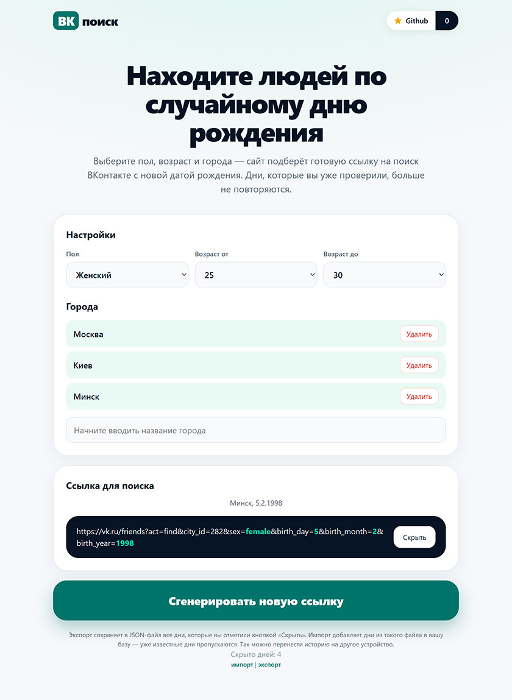

## ВК поиск
Стандартный поиск ВКонтакте показывает только первую 1000 пользователей поэтому в поиске нужно указывать не возраст, а день рождения тогда в выборку точно попадет меньше 1000 пользователей и вы никого не пропустите.

ВК поиск случайно генерирует день рождения в выбранном диапазоне возрастов, умеет сохранять уже просмотренные дни, а так же поддерживает несколько городов одновременно.

Лучший способ сказать спасибо - поставить ⭐ на Github!

## Как это работает
Официальная форма поиска ВКонтакте генерирует ссылку следующего вида:  
```
https://vk.ru/friends?act=find&city_id=1&sex=female&birth_day=28&birth_month=8&birth_year=2003
```  
ВК поиск просто генерирует такую же ссылку, перейдя по которой будет запущен поиск ВКонтакте так же как если бы вы ввели эти данные вручную в форму.  
ВК поиск избавит вас от самостоятельного выбора случайного дня, а так же сохранит дни которые вы уже смотрели.  

Работает прямо в браузере, установка и регистрация не нужна.  
После перезагрузки страницы данные сохранятся (используйте тот же браузер).  
Данные можно импортировать и экспортировать, чтобы перенести между браузерами.  
Доступно по ссылке https://vk.alex.md  

## Интерфейс

