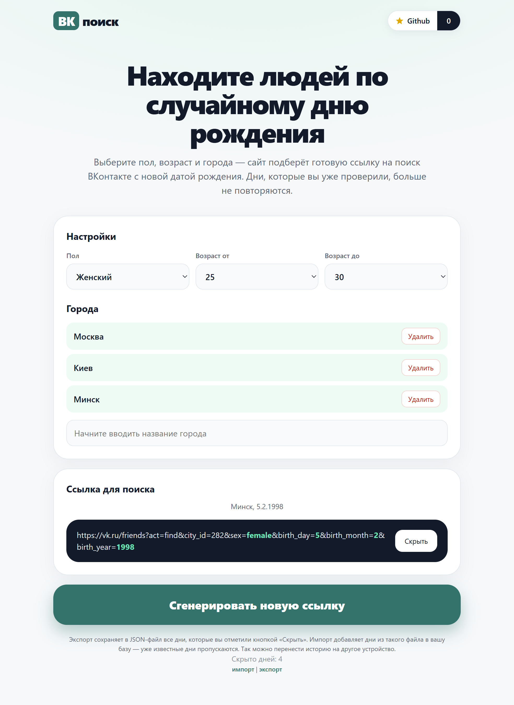

## ВК поиск
С ВК поиск ты точно никого не пропустишь!  
ВКонтакте показывает только первую 1000 пользователей поэтому запрос нужно разбивать по дням рождения, а не по возрасту, чтобы обойти это ограничение.

ВК поиск случайно генерирует день в выбранном диапазоне, умеет сохранять уже просмотренные дни, а так же поддерживает несколько городов одновременно.  
Лучший способ сказать спасибо - поставить ⭐ на Github!

## Принцип работы
Официальная форма поиска ВКонтакте генерирует ссылку следующего вида:  
`https://vk.ru/friends?act=find&city_id=1&sex=female&birth_day=28&birth_month=8&birth_year=2003`  
Приложение ВК поиск просто генерирует такую же ссылку, перейдя по которой будет запущен поиск ВКонтакте так же как если бы вы ввели эти данные вручную в форму.

## Запуск
Проще всего открыть в браузере по ссылке https://vk.alex.md.  

Однако вы можете скачать исходный код и запустить локально, для этого вам понадобится локальный сервер так как подгрузка городов не будет работать если просто открыть index.html в браузере как файл.

Данные об уже просмотренных днях хранятся в браузере в IndexedDB, вы можете их импортировать и экспортировать чтобы не потерять между переустановками браузера.

## Интерфейс

